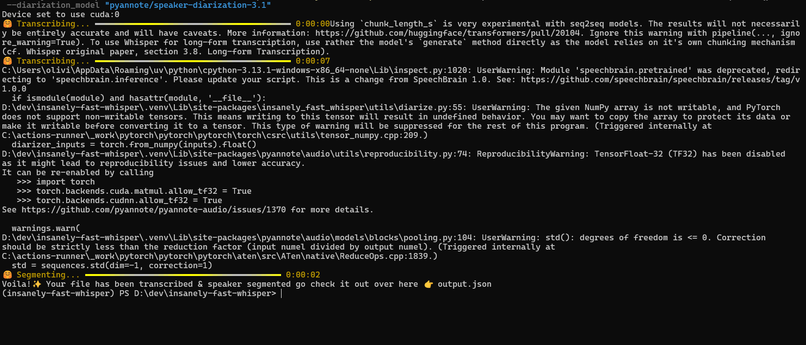
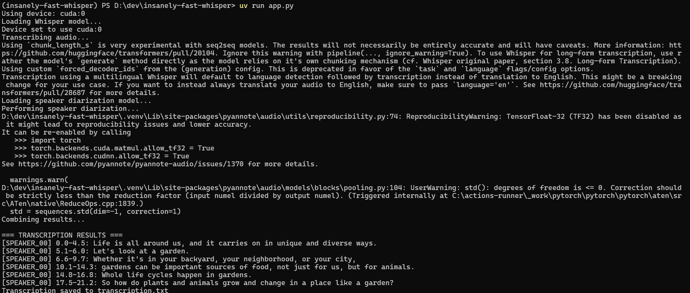

# ⚡ Audio Transcription: 2.5 Hours in 98 Seconds on Your Laptop
## How a radically optimized Whisper is a game-changer for local transcription.

That sounds like a marketing promise too good to be true. Yet, that's exactly what insanely-fast-whisper delivers—an ultra-optimized version of OpenAI's Whisper transcription model.

While the standard Whisper would take nearly 31 minutes to transcribe a 2.5-hour audio file, this implementation does it in under 2 minutes. And that's not all: it also integrates speaker diarization (who spoke and when?) directly into its pipeline.

Let's see how it works and how you can start using it today.

🚀 Under the Hood: Flash Attention 2 and Transformers Optimizations
The phenomenal performance gain (a 19x speed-up) doesn't come from magic. It's built on two major technical pillars:

Flash Attention 2: A vastly more efficient attention algorithm, optimized for memory and speed on modern GPUs. It significantly reduces computational overhead and memory consumption, allowing for processing larger batches of data.

Advanced optimizations from the Transformers library: The team at Hugging Face has continuously optimized the library to extract every last cycle of performance from NVIDIA GPUs and Apple Silicon (MPS) chips.

The result is a far more efficient use of your hardware's power, whether you have an NVIDIA graphics card or a MacBook with an Apple M1/M2/M3 chip.


## 🎙️ Built-in Speaker Segmentation (Diarization)
Transcribing is good. Knowing who said what is even better. This is called speaker diarization.

insanely-fast-whisper seamlessly integrates the pyannote/speaker-diarization-3.1 model into its pipeline. This means that with a single command, you get a timestamped transcript where each segment is attributed to a different speaker (e.g., "Speaker 1", "Speaker 2").

This feature is invaluable for:

Transcribing meetings and identifying participants.

Analyzing interviews or podcasts.

Processing legal or medical recordings.


## 🛠️ Installation and Usage Guide
Let's get practical. Here’s how to set up and use this tool on your machine.

Prerequisites
An NVIDIA GPU (with up-to-date CUDA drivers) or a Mac with an Apple Silicon chip (M1/M2/M3).

uv: An ultra-fast Python project and package manager, written in Rust. It's the modern equivalent of pip and virtualenv combined. Install it with a single command:

```bash
pip install uv
Step-by-Step Installation
```

1. Project and Virtual Environment Initialization

### Creates a new folder and a dedicated virtual environment
```bash
git clone https://github.com/OlivierLAVAUD/insanely-fast-whisper
cd insanely-fast-whisper
uv venv
```

### Activate the virtual environment
### On macOS/Linux:
```bash
source .venv/bin/activate
# On Windows (PowerShell):
.\.venv\Scripts\activate
```

2. Installing Dependencies
```bash
# Install the main package
uv pip install insanely-fast-whisper

# Install hf_xet (for optimized file handling with the Hugging Face Hub)
uv pip install hf_xet

# Install pyannote.audio for diarization
uv pip install pyannote.audio  
```

3. Installing PyTorch
It's crucial to install the version of PyTorch compatible with your CUDA version. For CUDA 11.8, for example:

```bash
uv pip install torch torchvision torchaudio --index-url https://download.pytorch.org/whl/cu118

```

4. Creating a Hugging Face Access Token

The diarization model (pyannote) is gated and requires accepting a license. You need to create an access token.

👉 Go to huggingface.co/settings/tokens.

👉 Click on "New token".

👉 Choose the "Fine-Grained" type.

👉 Give it a name (e.g., pyannote-diarization).

👉 Under "Permissions", select "Read" for model access.

👉 Under "Repository permissions", search for and select pyannote/speaker-diarization-3.1.

👉 Copy the generated token. You will need it to run the transcription.


## Running the Transcription

Once everything is configured, the command to run a transcription with diarization is simple

```bash
insanely-fast-whisper --file-name <audio.mp3> \
                      --device-id 0 \
                      --hf-token <your_hf_token_here> \
                      --diarization_model "pyannote/speaker-diarization-3.1"
```

Explanation of the arguments:

--file-name: The path to your audio file.
--device-id: The ID of the GPU to use (usually 0 for a single card).
--hf-token: The Hugging Face token you created.
--diarization_model: The model to use for segmentatio

## 📋 Command Options and Notes
The command offers many options to customize the processing:

👉 Note
```bash
usage: insanely-fast-whisper.exe [-h] --file-name FILE_NAME [--device-id DEVICE_ID] [--transcript-path TRANSCRIPT_PATH] [--model-name MODEL_NAME]
                                 [--task {transcribe,translate}] [--language LANGUAGE] [--batch-size BATCH_SIZE] [--flash FLASH] [--timestamp {chunk,word}]
                                 [--hf-token HF_TOKEN] [--diarization_model DIARIZATION_MODEL] [--num-speakers NUM_SPEAKERS] [--min-speakers MIN_SPEAKERS]
                                 [--max-speakers MAX_SPEAKERS


                                 https://huggingface.co/pyannote/speaker-diarization-3.1
```

--task: Choose between transcribe (default) and translate (for direct translation to English).

--language: Force the input language (e.g., fr for French).
--batch-size: Adjust the batch size to optimize performance on your specific GPU.
--timestamp: Choose the granularity of timestamps: chunk (by segments) or word (word-level).
--num-speakers: Specify a fixed number of speakers if you know it in advance.
⚠️ License Note: The pyannote/speaker-diarization-3.1 model requires you to accept its license on its Hugging Face page before you can use it. This is a necessary formality.

# 🐍 Building a Custom Transcription Application with uv run
For those who need more control or want to integrate transcription into a larger application, you can build a custom script. This approach offers benefits like better error handling, multiple export formats (TXT, JSON, SRT subtitles), and more granular control over the process.

# Simply run the app

Run the application with your audio file:

```bash
uv run app.py
```


# Results


